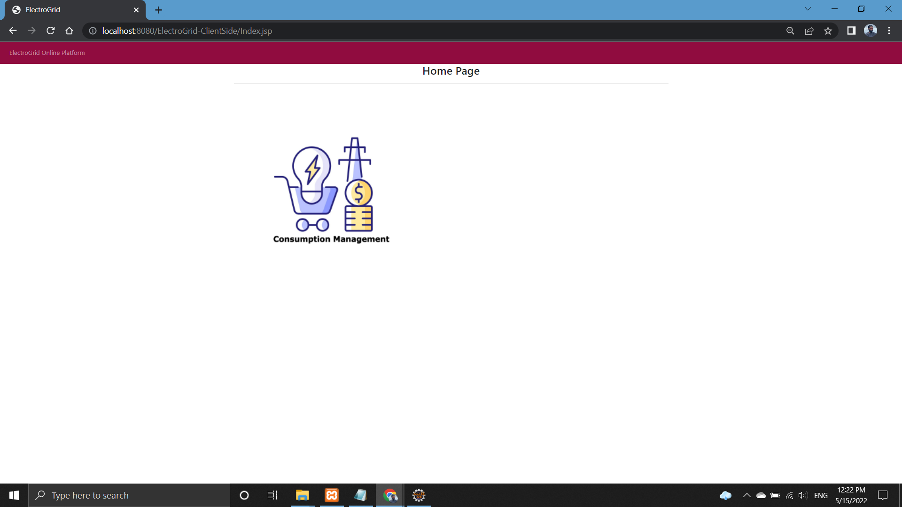

# ElectroGrid-ClientSide

# About Project
This project is based on a company named Electro Grid (EG) Who maintains the power grid of the country. I  developed Consumption function in this system.

# Technologies Used
-  java JAX-RS(jersy) Restful web service  
-  Apache  Tomcat  
-  mysql as the database 
-  eclipse IDE.

# How to execute the project?
Import the DB then clone the project and after it become cloned by using apache tomcat server the project can be execute.

#  Link  To ElectroGrid-ClientSide Database

# Screenshot of the UI

<h1>Homepage</h1>

<h1>Consumption Management</h1>

